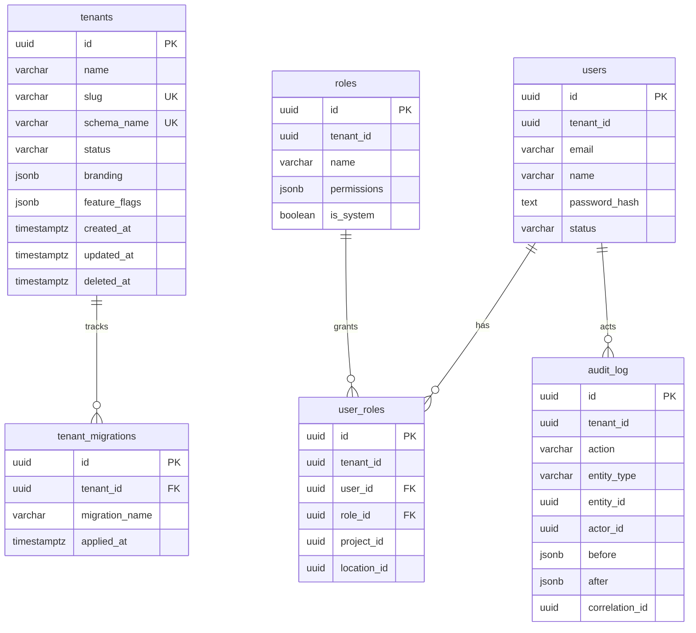

# Data Model

## Control Plane Schema (`public`)

Manages tenant registry and global configuration. See DEC-007.

### tenants

| Column | Type | Description |
|---|---|---|
| id | uuid | Primary key |
| name | varchar(255) | Tenant display name |
| slug | varchar(100) | URL-safe identifier |
| schema_name | varchar(100) | PostgreSQL schema name (`tenant_<slug>`) |
| status | varchar(50) | `provisioning`, `active`, `failed`, `suspended` |
| branding | jsonb | Logo, colors, custom branding |
| feature_flags | jsonb | Enabled features |
| created_at | timestamptz | Creation timestamp |
| updated_at | timestamptz | Last update timestamp |
| deleted_at | timestamptz | Soft delete timestamp |

### platform_users

Control-plane super admins (not tenant-scoped). Can create/list tenants via `/api/v1/platform/*`.

| Column | Type | Description |
|---|---|---|
| id | uuid | Primary key |
| email | varchar(255) | Unique login email |
| name | varchar(255) | Display name |
| password_hash | text | Argon2id hash |
| role | varchar(50) | `super_admin` |
| status | varchar(50) | `active`, `suspended` |
| created_at | timestamptz | Creation timestamp |
| updated_at | timestamptz | Last update timestamp |
| deleted_at | timestamptz | Soft delete timestamp |

### tenant_migrations

Tracks which migrations have been applied to each tenant schema.

| Column | Type | Description |
|---|---|---|
| id | uuid | Primary key |
| tenant_id | uuid | FK to tenants |
| migration_name | varchar(255) | Migration identifier |
| applied_at | timestamptz | When applied |

## Tenant Schema (per-tenant)

Each tenant schema (`tenant_<slug>`) contains the following base tables:

### users

| Column | Type | Description |
|---|---|---|
| id | uuid | Primary key |
| tenant_id | uuid | Tenant reference |
| email | varchar(255) | User email |
| name | varchar(255) | Display name |
| password_hash | text | Password hash |
| status | varchar(50) | active, inactive, suspended |
| created_at | timestamptz | Creation timestamp |
| updated_at | timestamptz | Last update timestamp |
| deleted_at | timestamptz | Soft delete timestamp |

### roles

| Column | Type | Description |
|---|---|---|
| id | uuid | Primary key |
| tenant_id | uuid | Tenant reference |
| name | varchar(100) | Role name |
| description | text | Role description |
| permissions | jsonb | Array of permission strings |
| is_system | boolean | System role (cannot delete) |

### user_roles

| Column | Type | Description |
|---|---|---|
| id | uuid | Primary key |
| tenant_id | uuid | Tenant reference |
| user_id | uuid | FK to users |
| role_id | uuid | FK to roles |
| project_id | uuid | Optional project scope |
| location_id | uuid | Optional location scope |

### audit_log

| Column | Type | Description |
|---|---|---|
| id | uuid | Primary key |
| tenant_id | uuid | Tenant reference |
| action | varchar(100) | create, update, delete, login, logout |
| entity_type | varchar(100) | user, role, lead, payment, etc. |
| entity_id | uuid | ID of the affected entity |
| actor_id | uuid | Who performed the action |
| before | jsonb | State before change |
| after | jsonb | State after change |
| correlation_id | uuid | Request correlation |
| ip_address | varchar(45) | Source IP |

### sessions (Phase 1)

| Column | Type | Description |
|---|---|---|
| id | uuid | Primary key |
| user_id | uuid | FK to users |
| refresh_token_hash | text | SHA-256 of opaque refresh token |
| expires_at | timestamptz | Expiry |
| revoked_at | timestamptz | Set on logout / rotation |

### password_reset_tokens (Phase 1)

| Column | Type | Description |
|---|---|---|
| id | uuid | Primary key |
| user_id | uuid | FK to users |
| token_hash | text | SHA-256 of reset token |
| expires_at | timestamptz | Expiry |
| used_at | timestamptz | When consumed |

### tenant_settings (Phase 1)

| Column | Type | Description |
|---|---|---|
| branding | jsonb | App name, colors, logo |
| feature_flags | jsonb | Module flags |
| channel_config_encrypted | text | AES-GCM encrypted channel secrets |

### projects / locations (Phase 1 stubs → Phase 2)

`projects` expanded with dates/budget/address. `locations` remain RBAC scope rows, synced from towers.

### Phase 2 hierarchy

| Table | Purpose |
|---|---|
| blocks | Project → block |
| towers | Block/tower; syncs `locations` for RBAC |
| floors | Tower floors |
| unit_categories | 2BHK/3BHK etc. |
| units | Unique (project,tower,floor,unit_number); status available/reserved/sold/blocked |
| unit_status_history | Audited status transitions |
| milestones / tasks / task_dependencies | Planning + FS deps (cycle-checked) |
| boq_items | Bill of quantities |
| drawings | Immutable versions per drawing_number |
| rfis / issues / approvals | Site coordination |

## ER Diagram

> Note: `users`, `roles`, `user_roles`, and `audit_log` live inside each tenant schema, not in `public`.

See individual module RFCs for additional tables.
